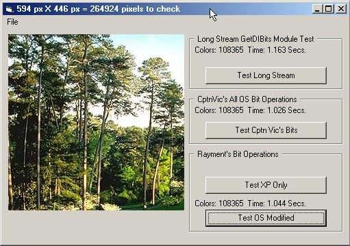

<div align="center">

## Count Colors In Pic \(Final update 15 June 06\)


</div>

### Description

Update 15 June 2006: (Thanks to Robert Rayment and Cobein for ideas/code!) This final (as far as I'm concerned) version now uses the GetDIBits API color stream to count the unique colors in a picture Very Quickly.

Tested in XP and Me... Not 95/98/NT yet (but should work). Masking colors returned in the GetDIBits array should resolve the OS problems that would otherwise occur.

In XP tests, three of these functions will counts a 1024x768 pic with 145,350 colors in +-.125 seconds and the 4th in +- .203 seconds... and that's not bad (Tests were compiled)!

This version includes 4 different functions for quickly counting unique colors. 2 are my work and 2 are modified from Rayment's code.
 
### More Info
 
A picture for the picture box

Moderators:

(I see the screen shot was missing...

This upload just to replace the screen shot)

Unique colors in said picture


<span>             |<span>
---                |---
**Submitted On**   |2006-06-15 19:48:20
**By**             |[CptnVic](https://github.com/Planet-Source-Code/PSCIndex/blob/master/ByAuthor/cptnvic.md)
**Level**          |Intermediate
**User Rating**    |5.0 (15 globes from 3 users)
**Compatibility**  |VB 4\.0 \(32\-bit\), VB 5\.0, VB 6\.0
**Category**       |[Graphics](https://github.com/Planet-Source-Code/PSCIndex/blob/master/ByCategory/graphics__1-46.md)
**World**          |[Visual Basic](https://github.com/Planet-Source-Code/PSCIndex/blob/master/ByWorld/visual-basic.md)
**Archive File**   |[Count\_Colo2001156152006\.ZIP](https://github.com/Planet-Source-Code/cptnvic-count-colors-in-pic-final-update-15-june-06__1-65318/archive/master.zip)

### API Declarations

```
GetDIBits
GetTickCount
```


